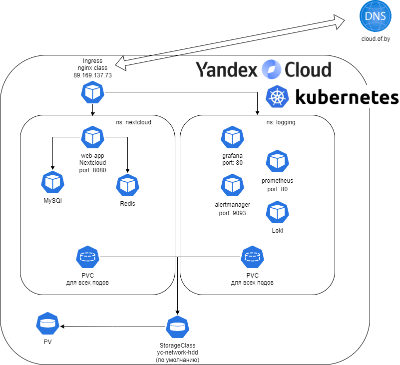

# OTUS. Инфраструктурная платформа на основе Kubernetes. 25 декабря 2024 года — 9 мая 2025
# Проектная работа

## Задание: подготовка MVP инфраструктурной платформы для приложения-примера

**МVP** — это аббревиатура, которая расшифровывается как Minimum Viable Product (минимально жизнеспособный продукт).  
Это начальная версия продукта, которая содержит только основные функции, необходимые для запуска на рынке и получения обратной связи от пользователей. Цель MVP — быстрее вывести продукт, минимизировать затраты на разработку и определить наиболее важные функции, которые ценят пользователи.

### Требовнания MVP платформы обязательно включает в себя:
+ Kubernetes (managed или self-hosted)
+ Мониторинг кластера и приложения с алертами и дашбордами
+ Централизованное логирование для кластера и приложений 
+ Обязательно в виде кода в репозитории:
   - Публичный
   - CI/CD пайплайн для приложения (Gitlab CI, Github Actions, etc)
   - Автоматизация создания и настройки кластера
   - Развертывание и настройки сервисов платформы
   - Настройки мониторинга, алерты, дашборды


В качестве MPV у меня будет:
+ Managed Kubernetes кластер в Yandex Cloud
+ Приложение Nextcloud (состоящее из Web-сервера Apache, сервера баз данных MySQL, кэшировние авторизаций Redis)
+ Мониторинг и логирование Loki-stack (Loki (хранение логов) + Prometheus (мониторинг) + Grafana (визуализация) + Alermanager (уведомления) + promtail (сбор логов))  




**Минимальные требования настройки для запуска и отработки GitHub Action:**
Предварительно надо надо 3 секрета разместить в github:
В настройках репозитория (Settings → Secrets → Actions вкладка Secrets) добавьте:

- [ ] YC_SA_KEY – содержимое key.json

- [ ] YC_FOLDER_ID – ID вашего фолдера в Yandex Cloud

- [ ] YC_CLOUD_ID – ID облака (можно найти в настройках облака)

Про содержимое key.json оно делаеться так:
нам надо создать сервисный аккаунт с правами достаточными для создания кубернетес кластера (k8s.clusters.agent и vpc.publicAdmin)
И запустить команду:
```
$RES_SA_ID=ID
yc iam key create --service-account-id <ID> --output key.json
#где <ID> = id этого сервисного аккаунта.
```
Так же надо получить статический внешний адрес для ingress-контроллера
```
yc vpc address create --external-ipv4 zone=ru-central1-a
yc vpc address list
# тот, что RESERVED = true и USED = false. Копируем его.
```
В настройках репозитория (Settings → Secrets → Actions вкладка Variables) добавьте:

- [ ] YC_STATIC_IP - IP ingress контроллера

Любая публикация в main ветку запустил Actions Workflow.

Ссылки на опубликованные приложения:  
[Nextcloud](http://next.cloud.of.by) - "облако" для файлов с совместным редактирвоанием и большим колилчесвом дополнительного функционала, например, почта, календарь, опросник, чат  
[Grafana](http://grafana.cloud.of.by) - визуализация мониторига и логирования  
[Prometheus](http://prometheus.cloud.of.by) - мониторинг  
[Alermanager](http://alertmanager.cloud.of.by) - уведомления  